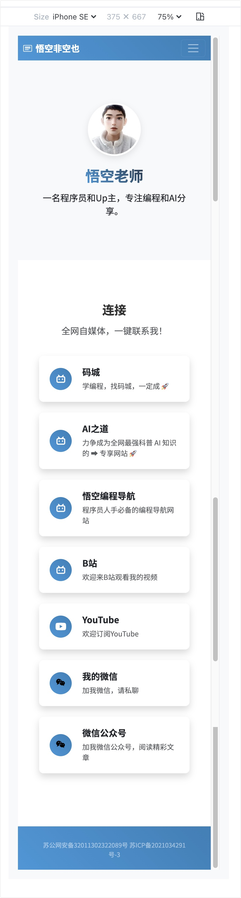

# LinkCard

## 项目简介
LinkCard 是一款轻量级的数字名片应用，专注于为用户提供简单而强大的个性化数字名片解决方案。它采用纯前端技术栈构建，无需后端服务支持，让用户可以轻松创建和分享个人数字名片。

## 在线预览
- 演示地址：[https://wukongnotnull.tech/](https://wukongnotnull.tech)

## 功能特点
- **个性化名片创建**：支持自定义姓名、职位、公司、签名等信息
- **多模板支持**：提供多种精美的卡片模板供选择
- **实时预览**：编辑时可实时预览效果，所见即所得
- **二维码分享**：自动生成包含名片信息的二维码，方便快速分享
- **社交媒体整合**：支持添加各类社交媒体账号链接
- **响应式设计**：完美适配各种设备屏幕尺寸

## 技术栈
- **前端框架**：Bootstrap 5.3.0
- **UI组件**：Bootstrap Icons 1.10.0
- **字体**：Google Fonts (Noto Sans SC)
- **功能实现**：原生JavaScript
- **二维码生成**：QRCode.js

## 项目结构
```
LinkCard/
├── css/
│   └── styles.css          # 自定义样式文件
├── js/
│   └── app.js              # 应用核心逻辑
├── images/                  # 图标和图片资源
├── index.html              # 主页面
├── resume.html             # 简历页面
└── README.md               # 项目文档
```

## 快速开始
1. 克隆项目到本地：
```bash
git clone https://github.com/wukongnotnull/LinkCard.git
```

2. 使用任意HTTP服务器启动项目，例如：
- 使用Python：`python -m http.server 8000`
- 使用Node.js：`npx serve`
- 使用VS Code Live Server插件

3. 在浏览器中访问对应地址（如：http://localhost:8000）

## 使用说明
1. 打开应用后，在表单中填写您的个人信息
2. 选择喜欢的卡片模板
3. 点击"预览"按钮查看效果
4. 使用生成的二维码或链接分享给他人

## 项目效果图


## 贡献指南
1. Fork 本仓库
2. 创建新的功能分支：`git checkout -b feature/AmazingFeature`
3. 提交您的更改：`git commit -m 'Add some AmazingFeature'`
4. 推送到分支：`git push origin feature/AmazingFeature`
5. 提交Pull Request

## 开源协议
本项目基于 MIT 协议开源，详细信息请参阅 [LICENSE](LICENSE) 文件。